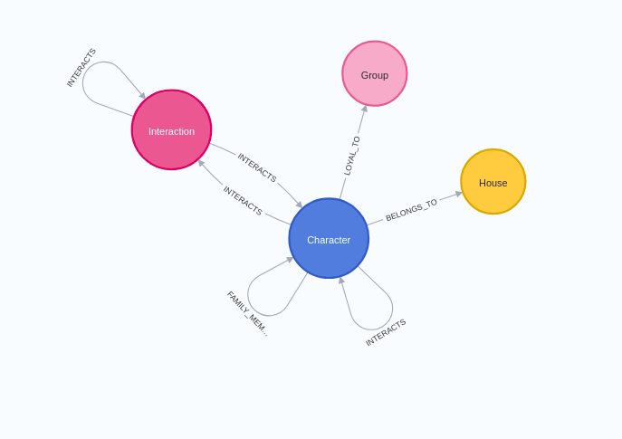
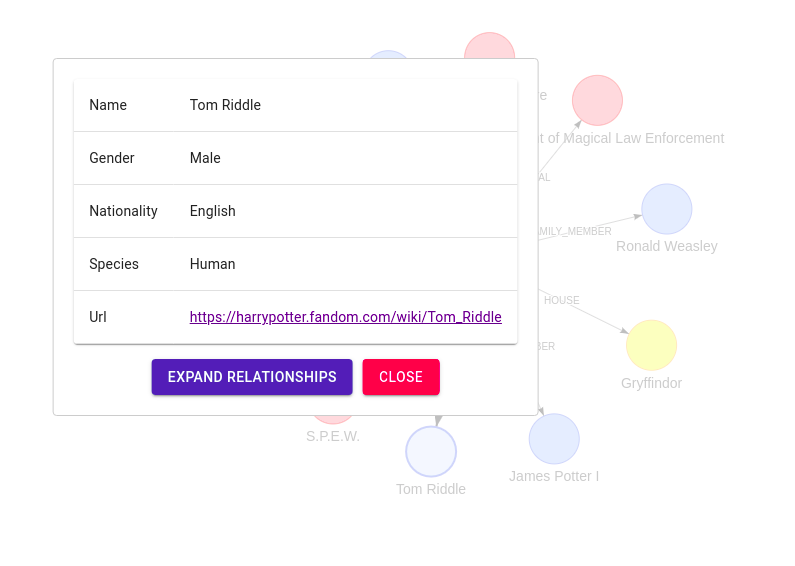
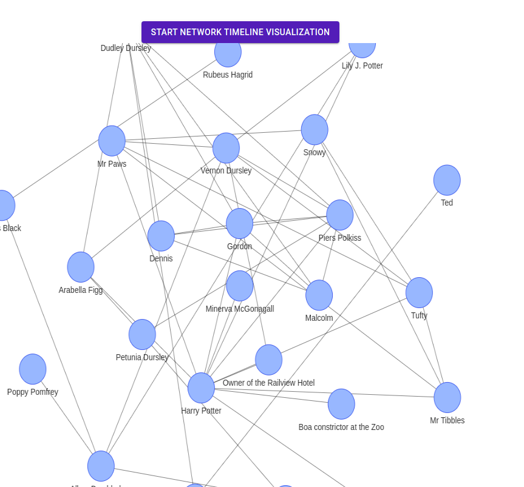
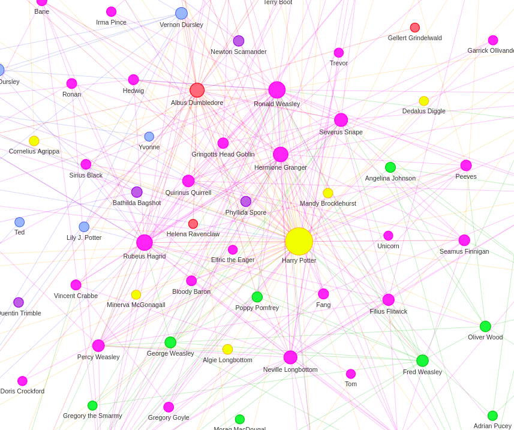

# neo4j-hp-viz

This project is a demo application for network visualizations using the https://grandstack.io[GRANDstack] (GraphQL, React, Apollo, Neo4j Database) application.
The dataset consists of characters and their interactions from the first Harry Potter book.
If you want to learn more about how the dataset was created check out https://medium.com/neo4j/turn-a-harry-potter-book-into-a-knowledge-graph-ffc1c45afcc8[my blog post].


The GraphQL endpoint is using the https://github.com/neo4j/graphql[Neo4j Graphql] library.
For the network visualizations, VisJS is being used.
I have also added click events to network visualization to make it an interactive explorer of your graph data.
Hopefully, this project will help you get started with implementing your own network visualizations with the GRANDstack.

Start the project with:

```
docker-compose up
```

## Seed data

Run the following command

```
cat seed_data.cql | docker exec -i neo4j cypher-shell -u neo4j -p letmein
```

Or if you are on windows

Open Neo4j Browser at localhost:7474. Login using username "neo4j" and password "letmein".
Execute the queries stored in the `seed_data.cql`

## Graph schema

Graph consists of characters from the first Harry Potter book, their interactions, to which house they belong, and to which group they are loyal.



## UI components

Frontend consists of the following components:

### Exploration

.Exploration component


This components features an autocomplete function using a Full-Text index.
Once you select a character, a small character subgraph is visualized.
If you click on any other characters a popup will show.
The popup has an option to expand relationships for a selected characters, giving it a bit of an interactivity.

### Timeline

.Timeline component


This component fetches all the interaction data from GraphQL.
When you click on the start button, it then adds a new relationship every 200ms, giving it a dynamic network visualization.
The relationships are ordered in the order they first appeared in the book, so in theory, you should see how relationships formed through time in the HP book.

### Network visualization

.Network component


This component visualizes a classic network analysis.
Nodes are colored based on the community they belong to and their size is calculated by how central in the network they are (pagerank).


